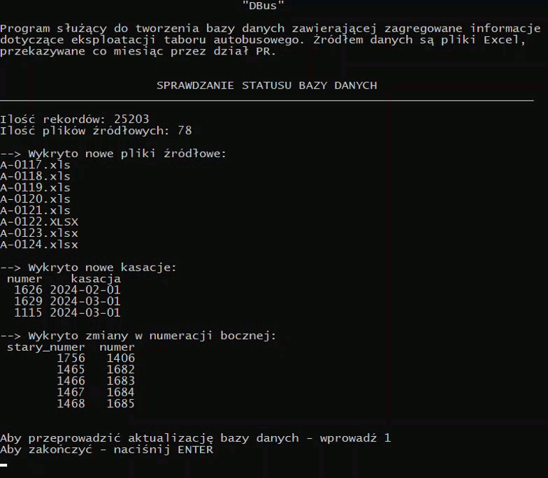

## 1. Description
Console based program designed to transform data stored in separated Excel files into one SQLite database. 
Collected data are related to bus fleet operated by local transport company and presents monthly updated information about: 
mileage, fuel/energy consumption, faults etc. Data files are not public due to privacy policy.

## 2. Functionality
* importing information from Excel files and storing them in unified table of SQLite database,
* data cleaning,
* checking status of database (info about records and loaded source files),
* checking status of new source files and modifications,
* updating database,
* managing problems with "side numbers" and decommissioning (details in chapter no. 3).

## 3. Solved problems
Apart from small work with data cleaning, the main problems of the project were:
- changes in "side numbers". Operated buses are identified by four digits called "side number". In Excel source files "side numbers" act like "id" and this makes troubles when it comes 
to their change. There is a problem with maintaining data consistency because in seperated source files the same bus can be identified differently (e.g. bus "1111" changed its
side number to "2222", which would be detected in the database as two different objects but in reality this is not true). Solution for this problem is to keep information about 
old and new side numbers in additional Excel file. By analyzing data contained in this file, program returns only current side numbers.

- decommissioning. Operation of significant number of buses involves process of regular renewal. Over the years, the oldest vehicles are replaced with new ones. Placing information 
about decommissioning in additional Excel file allows program to mark them in database - a special tag is added to the column with "side number" (eg. '1111_D20' means that bus with side
number '1111' was decommissioned in 2020 r.). It makes that data set is more transparent and prevent from overwriting information when new vehicle will have the same "side number" 
as bus withdrawn from service.

## 4. Used technology
Python 3 with specified libraries:  
* sqlite3,    
* pandas.

## 5. Showcase

